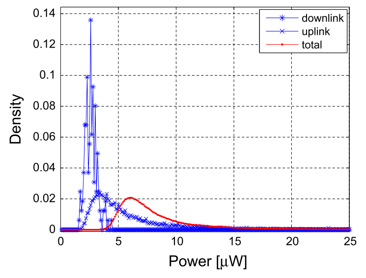
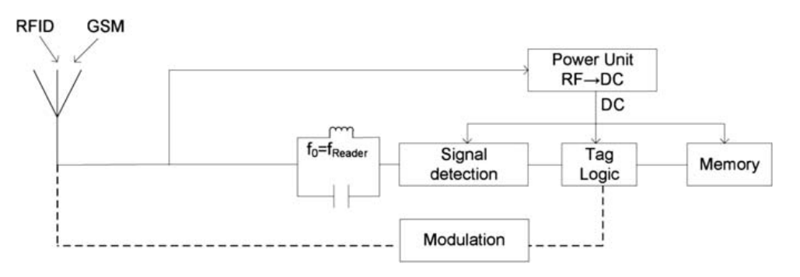

# 环境能量为无源设备供电的可能性
## 1. 概述
* 挑战
    1. 环境电磁能量弱，且能量随区域和时间的波动性大。根据[Russo2013](#russo2013)，驱动一个pulse oxymeter sensor传感器处理和发送数据需要约90 μW(约-10dBm)的功率。According to [12] modern tag ICs typically consume around 10–30 μW for reading, in [27] UHF RFID transponder IC with 16.7-μW minimum RF input power was presented, NXP Semiconductor’s UCODE G2iL(+) series ICs require 15.8 μW [28], Impinj’s Monza 5 series ICs require 16.6 μW [29] and Alien Technology’s Higgs series ICs require 14.1 μW [30]. Authors in [36] obtained 50% rectifier efficiency at 4 μW input power.
    
        - 总下行GSM功率（在大学内一点用频谱分析仪测得）平均约-26dBm (2.5 μW)
        - 单个手机1m远处的功率约为32uW（-15dBm）
        - 在95%的概率下总功率（GSM900上行+下行）至少为4.8uW（-23dBm）, 50%的概率下至少为7.34uW（-21.3dBm），10%的概率下至少为16.8uW（-17.7dBm）
        > use quarter wave ground plane antenna (3 dBi gain)
        > 890– 915MHz for uplink and 935–960MHz for downlink
        
        
        
* 两个方向：开源和节流
* dbm = 10*log(P/1mW)

    |P|1W|100mW|10mW|1mW|100μW|10μW|1μW|
    |-|-|-|-|-|-|-|-|
    |dBm|30|20|10|0|-10|-20|-30|
* The power received by tag can be expressed in simplified form by Friis equation with addition term representing the harvested power
    
    
    
    其中P的单位为Watts，G的单位是dBi，$lambda$为波长、d为reader与tag间的距离，单位为meters。Given equation represents simplified model, com- plete link budgets in tag–reader communication, dependence on polarization match coefficient, impedance match, tag radar cross section and reflections in room can be found in [25,26].
## 2. 相关文献
1. M. Russo, P. Šolić & M. Stella (2013) **Probabilistic modeling of harvested GSM energy and its application in extending UHF RFID tags reading range**, Journal of Electromagnetic Waves and Applications, 27:4, 473-484, DOI: [10.1080/09205071.2013.753659](https://doi.org/10.1080/09205071.2013.753659)

    > 用概率方法对可以收获的全球移动通信系统（GSM）能量的可能数量进行建模，包括演示使用GSM整流天线（整流天线）可以获得的功率水平。除了采集方法，还提出了其用于增加射频识别（RFID）阅读器和无电池无源RFID标签之间通信范围的应用。
    >
    > 90 μW is enough to power a pulse oxymeter sensor, to process data and to transmit them at intervals of 15 s.
    > For UHF Gen2 passive tag to function properly, the antenna needs to deliver enough
power to turn its Integrated Circuit (IC) on and its range depends on the efficiency of the tag antenna, rectifier, and IC power consumption. Tag IC typically consumes **10–30 μW** of power, when they are being read [12]
    > 
    > in 95% of cases we obtain range increase of 0.65 m, in 50% of cases range increase of 1.03m and in the 10% of cases 2.85m of increase.
